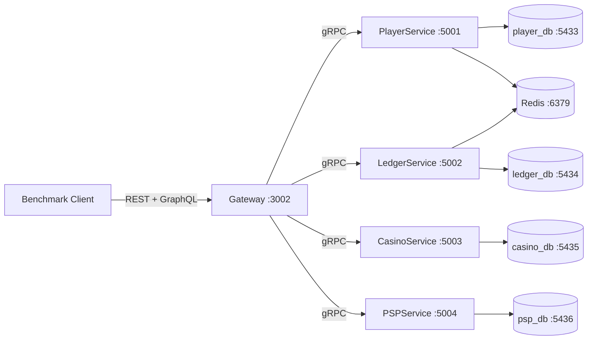

# Casino Wallet — Microservices Benchmark Shootout

<!-- Languages -->


<!-- Frameworks -->


<!-- Infrastructure -->


Head-to-head performance comparison of **.NET 10**, **Go + Fiber**, and **Bun + Elysia** running an identical casino wallet **microservices** workload with gRPC, GraphQL, PostgreSQL, and Redis.

## Architecture



**4 separate PostgreSQL databases** — true microservices, no shared DB. **Redis** for caching and distributed locks. **gRPC** for inter-service communication. **GraphQL** + **REST** for the Gateway BFF.

## Repository Map

```
.
├── apps/cs/             # .NET 10 — gRPC, EF Core, HotChocolate GraphQL
│   ├── src/
│   │   ├── Gateway/     # BFF: REST + GraphQL, no DB access
│   │   ├── PlayerService/
│   │   ├── LedgerService/
│   │   ├── CasinoService/
│   │   ├── PSPService/
│   │   └── Shared/      # Domain entities, Redis, config
│   └── init/            # Per-service PostgreSQL init scripts
├── apps/go/             # Go + Fiber (TBD)
├── apps/js/             # Bun + Elysia (TBD)
├── clients/loadtest/    # Python benchmark harness (wrk, k6, py-async)
├── init-scripts/        # Shared infra seed data
├── k8s/                 # Kubernetes manifests
├── shared/proto/        # gRPC contract definitions
├── docker-compose.yml   # 12 containers: 4 PG + Redis + Prometheus + 5 services
└── prometheus.yml
```

## Quick Start

```bash
# 1. Start everything (DBs, Redis, Prometheus, all microservices)
docker compose up -d --build

# 2. Wait for seeding (100K players + 100K wallets)
docker compose ps  # all should show "healthy"

# 3. Smoke test
curl -s http://localhost:3002/health
# → Healthy

# 4. Run benchmarks
python3 -m clients.loadtest run --ecosystem cs --client wrk
```

## Benchmark Results

<!-- SUMMARY -->

## Player Journey — .NET 10

**185 complete journeys** in 20s (120 concurrency). Each journey: signup → login → deposit → 9× (auth → bet → win) → transactions → withdraw → logout.

| Metric         | Value      |
| -------------- | ---------- |
| Total requests | 7,808      |
| Throughput     | 9.25 req/s |
| Avg latency    | 338.86ms   |
| p50            | 228.56ms   |
| p95            | 716.15ms   |
| p99            | 2,904.43ms |
| Max            | 7,648.66ms |

### Per-Step Latency

| Step         | Count | Avg        | p50        | p95        | p99        |
| ------------ | ----- | ---------- | ---------- | ---------- | ---------- |
| signup       | 220   | 2,367.77ms | 1,000.71ms | 7,010.68ms | 7,536.05ms |
| login        | 220   | 195.96ms   | 213.45ms   | 400.86ms   | 638.80ms   |
| deposit      | 220   | 198.92ms   | 204.47ms   | 340.10ms   | 420.55ms   |
| auth         | 1,993 | 108.64ms   | 87.92ms    | 255.90ms   | 441.58ms   |
| bet          | 1,993 | 425.11ms   | 441.43ms   | 740.29ms   | 796.44ms   |
| win          | 1,993 | 418.31ms   | 437.28ms   | 727.83ms   | 897.70ms   |
| transactions | 729   | 145.64ms   | 102.09ms   | 438.21ms   | 466.01ms   |
| withdraw     | 220   | 91.45ms    | 44.86ms    | 266.15ms   | 453.94ms   |
| logout       | 220   | 65.06ms    | 14.06ms    | 278.71ms   | 399.56ms   |

> Full per-scenario results: `results/loadtests/DotNet/PlayerJourney_py-async.md`

<!-- /SUMMARY -->

> **Auto-updated** after every `python3 -m clients.loadtest run`. Run benchmarks, README updates itself.

## Test Configuration

| Parameter               | Value                       |
| ----------------------- | --------------------------- |
| Tool                    | wrk                         |
| Threads                 | 2                           |
| Connections             | 120                         |
| Duration                | 20s per scenario            |
| Players seeded          | 100,000                     |
| Wallet starting balance | $100,000 (10,000,000 cents) |

## Service Endpoints

| Service       | Port      | Database       | Protocol       |
| ------------- | --------- | -------------- | -------------- |
| Gateway (BFF) | 3002      | None           | REST + GraphQL |
| PlayerService | 5001      | player_db:5433 | gRPC           |
| LedgerService | 5002      | ledger_db:5434 | gRPC           |
| CasinoService | 5003      | casino_db:5435 | gRPC           |
| PSPService    | 5004      | psp_db:5436    | gRPC           |
| PostgreSQL ×4 | 5433–5436 | —              | SQL            |
| Redis         | 6379      | —              | Redis          |
| Prometheus    | 9090      | —              | HTTP           |
