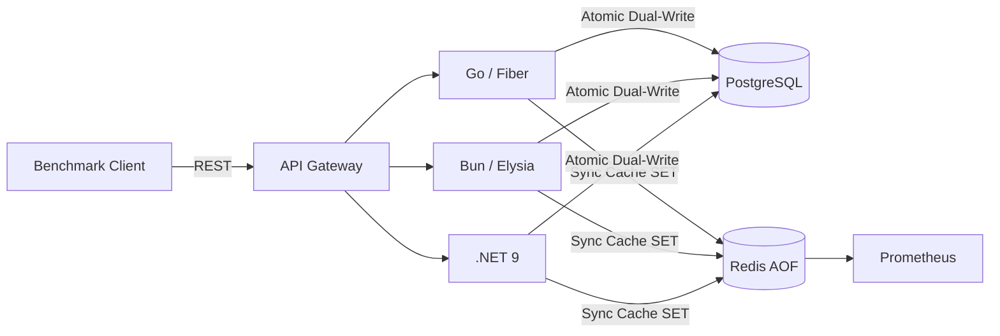

# Ecosystem Web API Performance — iGaming Synchronous CQRS Benchmark Shootout

Head-to-head performance comparison of **Bun + Elysia**, **Go + Fiber**, and **.NET 9** running an identical casino wallet **synchronous dual-write** workload against shared PostgreSQL and Redis infrastructure.

## Repository Map

```
.
├── apps/
│   ├── go/          # Go + Fiber — fasthttp, zero-alloc, pgxpool, rueidis
│   ├── js/          # Bun + Elysia — TypeBox, Bun.sql, in-process cache
│   └── cs/          # .NET 9 — Span<T>, Pipelines, GeneratedRegex, zero-GC
├── clients/         # Load-generation harness (benchmark client)
├── init-scripts/    # PostgreSQL schema + 100K-player seed data
├── k8s/             # Kubernetes manifests (namespace, Redis, resource limits)
├── proto/           # gRPC contract definition (ledger.proto)
├── docker-compose.yml   # Local dev stack (PG 16, Redis 7 AOF, Prometheus)
├── prometheus.yml       # Prometheus scrape config (2s interval, K8s pod discovery)
├── HOW-TO-START.md      # Step-by-step setup guide
└── .github/
    └── copilot-instructions.md   # Ponytail agent rules
```

## Architecture



## Shared Infrastructure

| Component  | Version    | Role                                        |
| ---------- | ---------- | ------------------------------------------- |
| PostgreSQL | 16-alpine  | Write-side ledger (source of truth)         |
| Redis      | 7.2-alpine | Read-side cache (AOF everysec, allkeys-lru) |
| Prometheus | 2.45.0     | Metrics collection (2s scrape)              |

## Quick Start

```bash
# 1. Spin up infrastructure
docker compose up -d

# 2. Verify seed data (100K players)
docker exec -it casino_postgres psql -U engine_admin -d casino_db -c "SELECT COUNT(*) FROM wallets;"

# 3. Pick a stack and run it — see HOW-TO-START.md
```

## Benchmark Rules

- All three stacks share the same Postgres and Redis instances
- Every write is a synchronous dual-write: PG transaction + Redis SET before response
- Balance reads hit Redis first; Postgres is the cold-miss fallback
- K8s manifests enforce identical CPU/memory limits across runtimes
- No runtime gets extra resources — equal footing, fair fight
